# RPlaceV2 DApp Report

**Name**: Nguyen Xuan Nam

**SID**: 21195511

**Course**: HKUST COMP4541

## Source Code

- Repository, Front-end: [GitHub - vnnamng/rplace-dapp](https://github.com/vnnamng/rplace-dapp)
- Submodule, Contract: [GitHub - vnnamng/rplace_contract](https://github.com/vnnamng/rplace_contract)

## 📌 Motivation

The **RPlaceV2 DApp** draws inspiration from two powerful ideas:

- **Reddit's r/place (2017, 2022):** A social experiment where users collaboratively drew on a shared canvas by placing one pixel at a time, limited by a cooldown. It highlighted coordination, community rivalry, and emergent behavior.

- **Land Property Auctions:** In the real world, land is scarce and owned. Property markets are driven by demand, competition, and valuation. RPlaceV2 maps this idea to a pixel canvas where each pixel is a unique digital asset, purchasable and owned on the blockchain.

Together, RPlaceV2 transforms a social game into a decentralized economic experiment on **Ethereum**, where canvas pixels are digital property owned and traded using ETH.

---

## 🔗 How It Works

### 1. Connect Wallet

- Users install **MetaMask** and add the **Sepolia testnet**.
- On clicking **Connect Wallet**, MetaMask connects the user’s Ethereum address to the DApp.

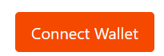
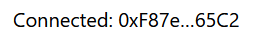

---

### 2. Acquire SepoliaETH

- Test currency is needed to interact with the DApp.
- Users get **SepoliaETH** from public faucets like:

  - [Google Cloud Faucet](https://cloud.google.com/application/web3/faucet/ethereum/sepolia)
  - [PK910 Faucet](https://sepolia.pk910.de)

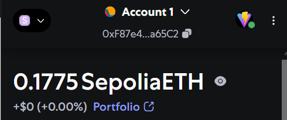

---

### 3. Select and Buy Pixels

#### 🎨 Pixel Selection

- Users can **click** to select multiple pixels.
  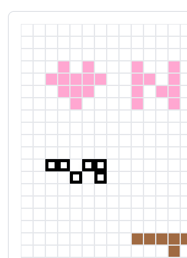
- The selected pixels are highlighted with a **bolded border**.
- Users can **deselect** pixels by clicking them again.
- Click **Clear Selection** at the bottom to remove all selected pixels.

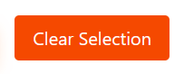

#### 🎨 Color Palette

- There are **10 predefined color choices** available.
- The selected color is applied to all chosen pixels.

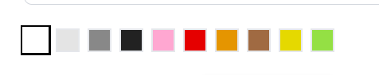

#### 💰 Set ETH Price and Buy

- After selection, users enter a price in **ETH per pixel**.
- On clicking **Buy**, a transaction is submitted to the smart contract.
- Ownership and color of the pixels are updated **on-chain**.

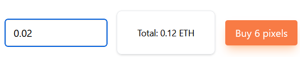---

#### Confirming the Transaction

- Users confirm the transaction in MetaMask.
  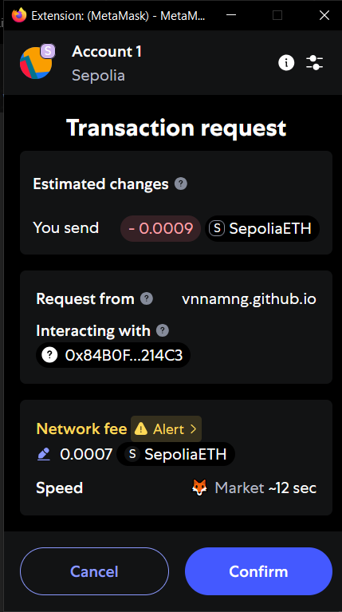
- The transaction is processed on the **Sepolia testnet**.
- The **canvas** updates in real-time to reflect the new pixel ownership and color.

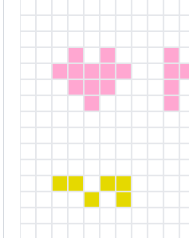

## 🧠 Smart Contract Features

### 👁️ Live Ownership Tracking

- Each pixel is tied to a specific **wallet address**.
- Users can hover or click pixels to see current owner information.

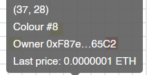

---

### 🏆 Leaderboards

- Two live leaderboards are maintained:

  - **Top ETH Spenders**: Total ETH spent on pixel purchases
  - **Top Landlords**: Number of pixels owned

- These rankings update in **real-time** via smart contract event listeners.
- Yellow highlights the current wallets in each leaderboard.
  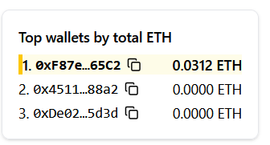
  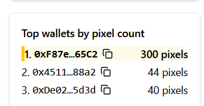

---

## 🛠 Development Details

- **Smart Contract**: `1_PixelWarV2.sol`, deployed to Sepolia
- **Frontend**: Built with **React + Vite**
- **Real-Time Updates**: Powered by Ethereum events and UI state syncing
- **Contract Address**: `0x84B0FD3dd1288542f4E189f8170eB94B303214C3`
- **ABI**: See [`src/constants.js`](src/constants.js)

## Errors and Issues

### Why Transactions May Fail:

1. **Insufficient Balance**
   The wallet does not have enough SepoliaETH to cover the total pixel cost and gas fees.

2. **Pixel Already Owned by Someone Else**
   Between selection and purchase, another user might have bought one or more of the selected pixels.

3. **Gas Limit Too Low**
   Complex transactions involving many pixels may exceed the gas limit set in MetaMask.

4. **Network Issues / Timeout**
   MetaMask may reject or drop transactions due to RPC failures or user denial.

5. **Invalid Parameters**
   For example:

   - Price per pixel is zero or too high
   - Invalid color index
   - Empty pixel selection

6. **Smart Contract Errors**

   - Revert conditions in Solidity such as duplicate ownership or invalid array input sizes.

### Troubleshooting Tips:

- Ensure at least **0.0001 SepoliaETH** is available before purchasing.
- Try buying fewer pixels at once if the gas cost is too high.
- Refresh the canvas to check for pixel ownership updates before submitting.
- Always verify parameters before confirming the transaction in MetaMask.
